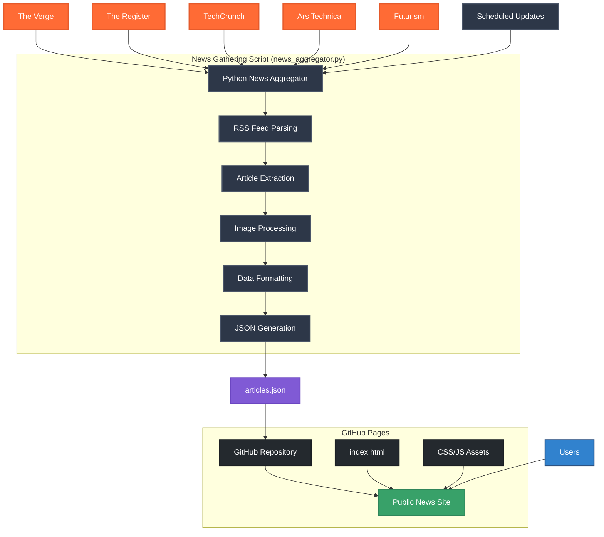

# Tech News Aggregator Site

This is a Python-based news aggregator that fetches articles from various tech news sources and displays them in a clean, modern web interface.

It is viewable here: https://dankniight.github.io/tech-news-aggregator/

## Features

- Aggregates news from multiple sources (The Verge, The Register, TechCrunch, Ars Technica, Futurism)
- Displays articles with images when available
- Responsive design that works on desktop and mobile
- Dark/light mode toggle with system preference detection
- Shuffle Mode for re-arranged non-chronological articles


## Architecture


## Setup

1. Install dependencies:
   ```
   pip install -r requirements.txt
   ```

2. Run the aggregator to fetch news:
   ```
   python src/news_aggregator.py
   ```

3. Serve the `index.html` file with any web server
